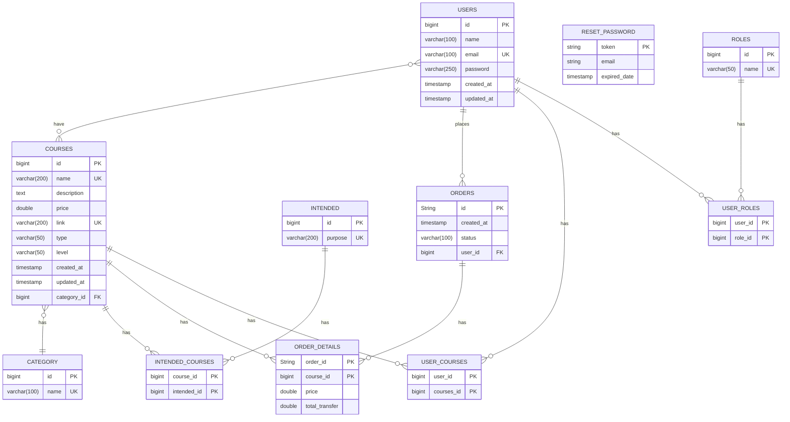

ERD

```mermaid
erDiagram
    USERS {
        bigint id PK
        varchar(100) name
        varchar(100) email UK
        varchar(250) password
        timestamp created_at
        timestamp updated_at
    }

    COURSES {
        bigint id PK
        varchar(200) name UK
        text description
        double price
        varchar(200) link UK
        varchar(50) type
        varchar(50) level
        timestamp created_at
        timestamp updated_at
        bigint category_id FK
    }

    RESET_PASSWORD {
        string token PK
        string email
        timestamp expired_date
    }

    CATEGORY {
        bigint id PK
        varchar(100) name UK

    }

    INTENDED {
        bigint id PK
        varchar(200) purpose UK
    }

    INTENDED_COURSES {
        bigint course_id PK
        bigint intended_id PK
    }

    USER_COURSES {
        bigint user_id PK
        bigint courses_id PK
    }

    USER_ROLES {
        bigint user_id PK
        bigint role_id PK
    }

    ROLES {
        bigint id PK
        varchar(50) name UK
    }

    ORDERS {
        String id PK
        timestamp created_at
        varchar(100) status
        bigint user_id FK
    }

    ORDER_DETAILS {
        String order_id PK
        bigint course_id PK
        double price
        double total_transfer
    }

    USERS }o--o{ COURSES : have
    USERS ||--o{ ORDERS : places
    USERS ||--o{ USER_COURSES : has
    USERS ||--o{ USER_ROLES : has
    ROLES ||--o{ USER_ROLES : has
    COURSES }o--|| CATEGORY : has
    COURSES ||--o{ INTENDED_COURSES : has
    COURSES ||--o{ ORDER_DETAILS : has
    COURSES ||--o{ USER_COURSES : has
    INTENDED ||--o{ INTENDED_COURSES : has
    ORDERS ||--o{ ORDER_DETAILS : has
```